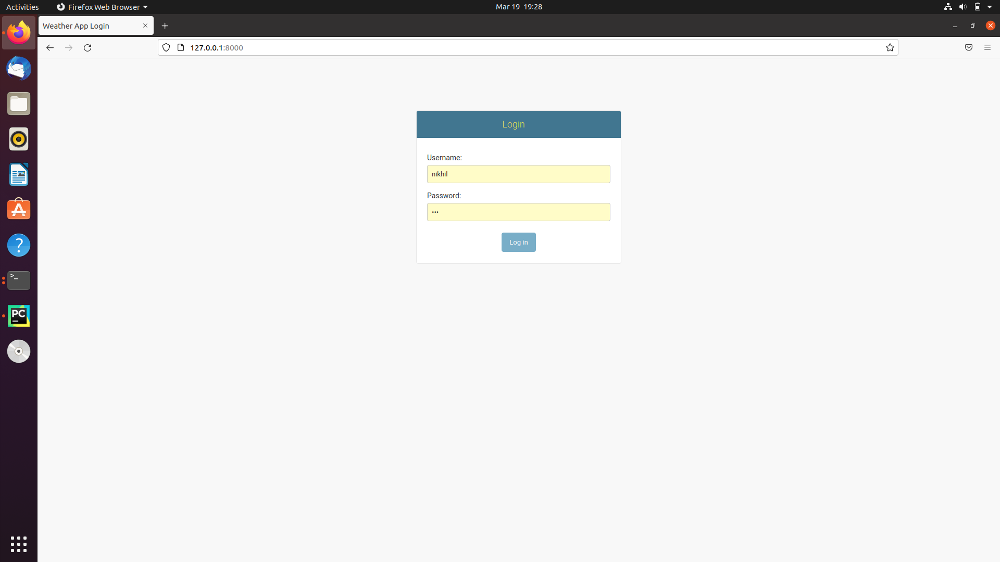
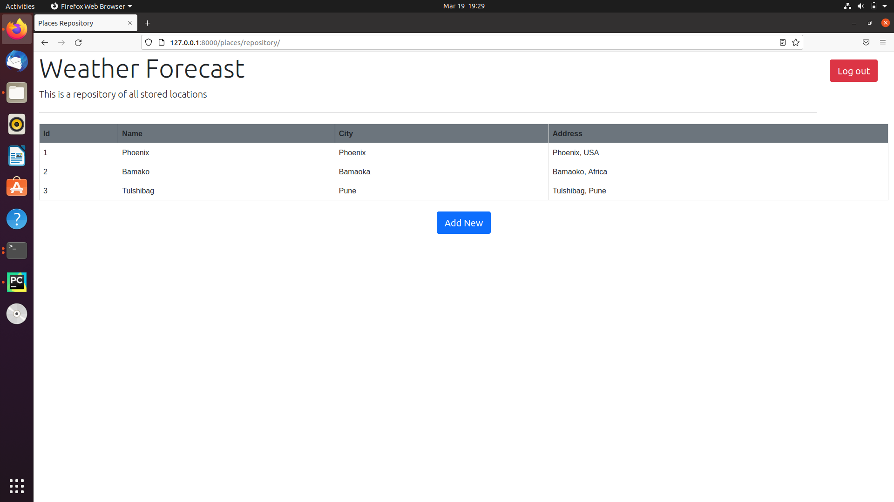
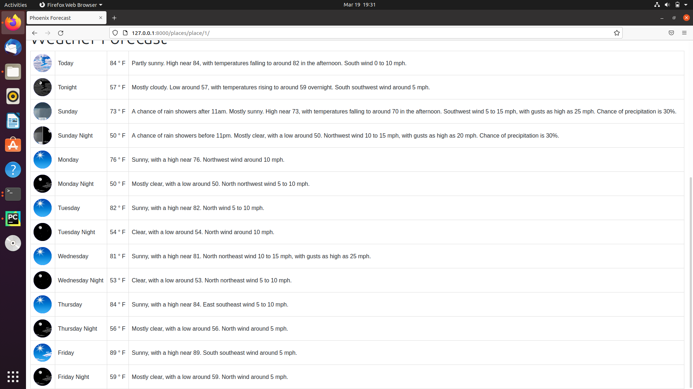
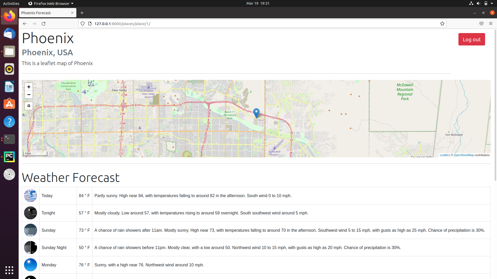
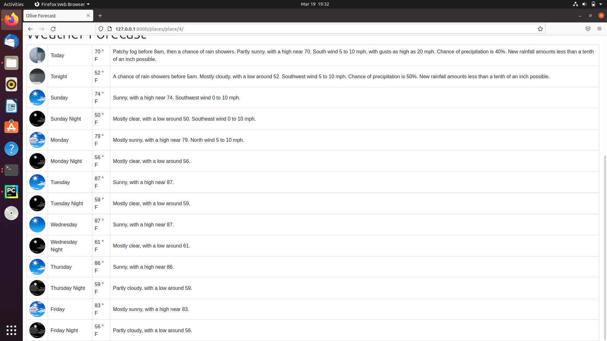
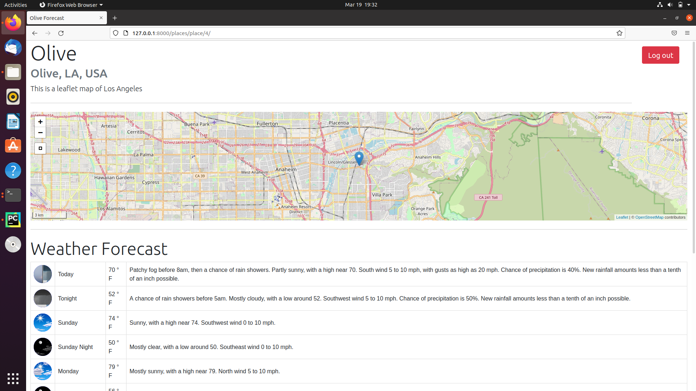
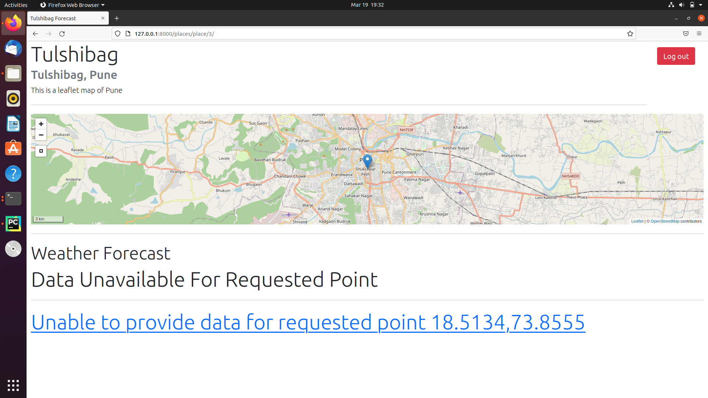
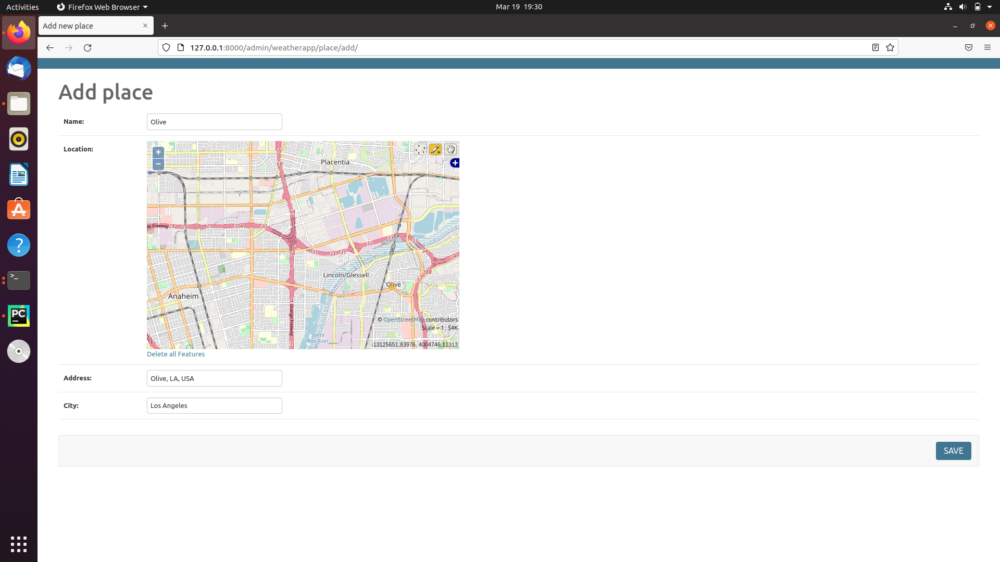
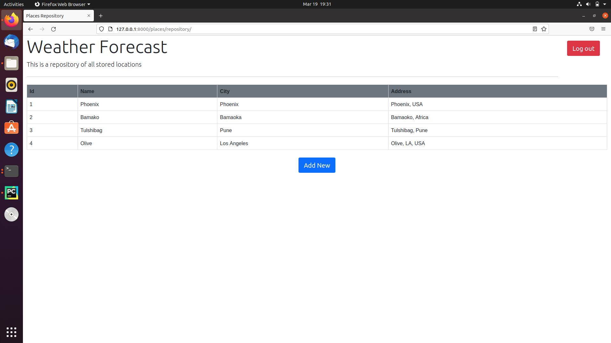
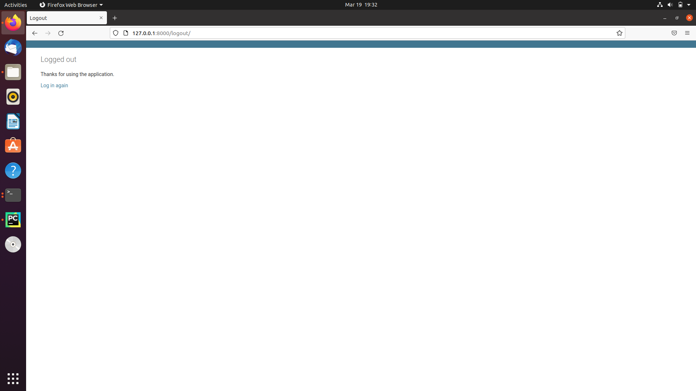

# ECGeo
A GeoDjango web application to store locations and retrieve weather forecasts

<b>Installation Steps(Assuming all GDAL/GEOS libraries are 
already installed along with python3):</b>

I have used a docker image that provided PostgresSQL and PostGIS service as per reference and to save time in setup

    1.Get docker image ffor postgres and postgis service using 
      sudo docker run --name=postgis -d -e POSTGRES_USER=user001 -e POSTGRES_PASS=123456789 -e POSTGRES_DBNAME=gis -p 5432:5432 kartoza/postgis:9.6-2.4

    2.Install requirements from requirements.txt using pip install -r requirements.txt

    3.Create your superuser

    4.run application and start adding new places

Here I have overriden the django admin login template to server as my custom template

The repository is the collection of all stored places, each row is clickable which takes user to the individual place view with weather forecast

Following examples of individual place view with a leaflet map and forecast for available periods

This is a location within Pune,India, but no weather forecast was retreived for this location.
The required API serves USA locations only!

Here again I had to override the Create view from django admin as for some unknown reason, the Pointfield would not render as a map in my own ModelForm.
Due to time constraint I decided to use the admin change form itself by overriding the template.
On save the user is redirected back to repository.

Finally, the logout page is also overridden.

References:-

1. https://docs.djangoproject.com/en/3.2/ref/contrib/gis/tutorial/
2. https://realpython.com/location-based-app-with-geodjango-tutorial/
